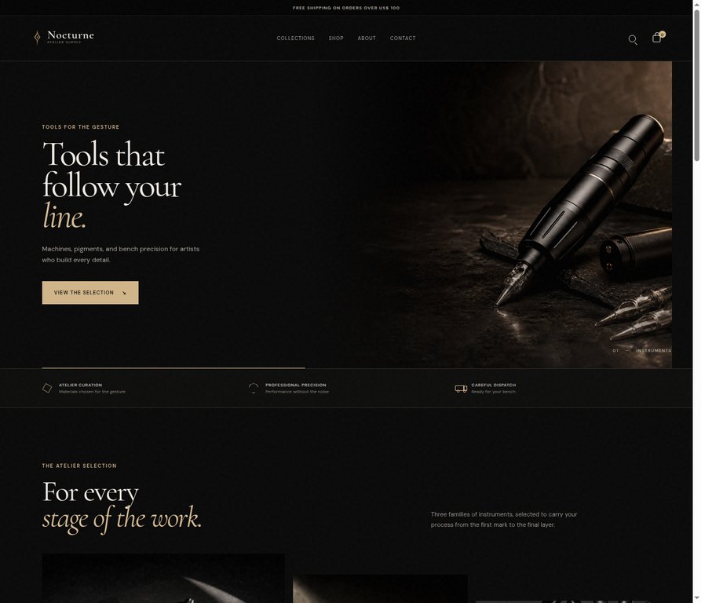
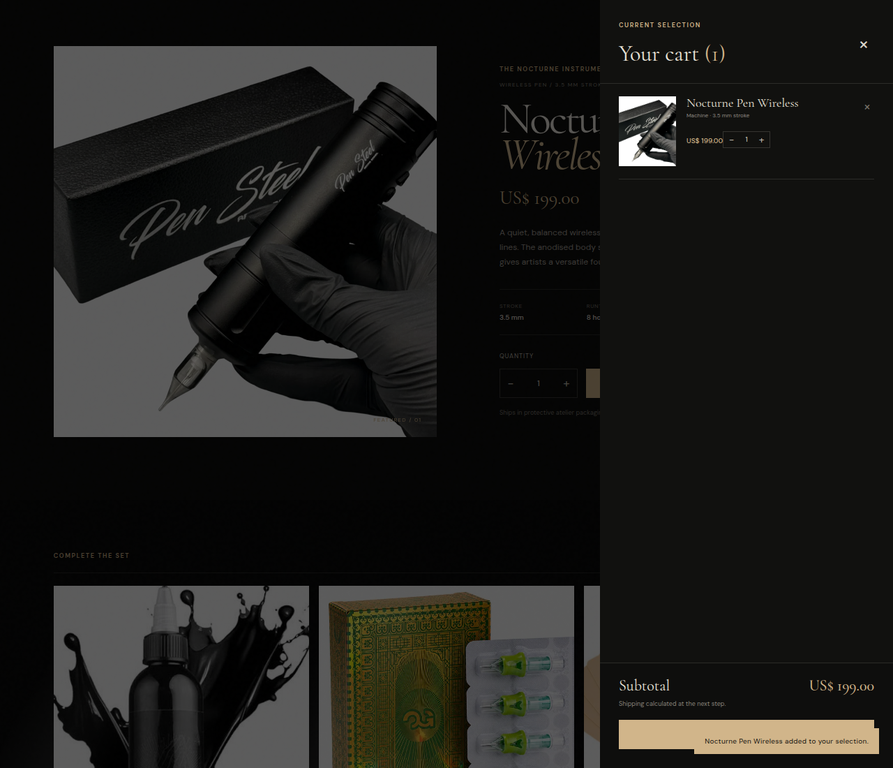

# Nocturne Atelier

Nocturne Atelier is a dark, editorial e-commerce storefront for tattoo and art-supply instruments. The interface is intentionally presented in English to demonstrate readiness for international clients and teams while keeping the implementation lightweight, dependency-free, and easy to review.

> **Portfolio note:** This project is a front-end commerce demonstration. It models the key storefront and cart interactions without processing real payments or connecting to a commerce backend.

## Project objective

The objective is to create a refined storefront that makes professional tattoo tools feel considered, tactile, and easy to evaluate. The experience combines an art-directed landing page with a practical product detail flow, accessible cart drawer, product merchandising, and newsletter capture.

The latest iteration specifically strengthens the project as an international portfolio piece by translating all customer-facing copy to English, adding a complete featured product page for the **Nocturne Pen Wireless**, and documenting a deliberate quality-assurance process.

## Target audience

The storefront is designed for professional tattoo artists, apprentices building a reliable kit, and creative practitioners who value precision, material quality, and a calm purchasing experience. The visual language also targets independent ateliers and design-conscious e-commerce brands looking for a premium, editorial presentation.

## Features

| Area | Included experience |
| --- | --- |
| Storefront | Editorial hero, collection rail, recent-arrival product grid, manifesto, and footer navigation |
| Product detail | Product image, price, long-form description, specifications, quantity selector, add-to-cart action, shipping note, and related products |
| Cart | Slide-in cart drawer, item thumbnails, subtotal, quantity increase/decrease, remove action, empty state, and demo checkout CTA |
| Navigation | Desktop navigation, mobile menu drawer, anchor-based section navigation, visible focus states, and Escape-to-close behavior |
| Merchandising | Consistent product cards, quick-add controls, related-products section, hover states, and responsive content hierarchy |
| Communication | Client-side newsletter validation with live success feedback and no page reload |
| Accessibility | Semantic landmarks, labelled controls, descriptive image alt text, live regions for cart counts/status, and keyboard-friendly drawers |

## Tech stack

| Technology | Role |
| --- | --- |
| HTML5 | Semantic storefront structure and accessible form controls |
| CSS3 | Design tokens, editorial layout, product art direction, motion, and responsive breakpoints |
| Vanilla JavaScript | Product data, rendering, cart state, quantity logic, drawers, toast feedback, and newsletter behavior |
| Google Fonts | Cormorant Garamond for display typography and DM Sans for interface copy |
| Local image assets | Hero, collections, product photography, and Nocturne sigil |
| GitHub Pages-friendly structure | Static `index.html`, `css/`, `js/`, and `assets/` folders with no build step |

## Responsive behavior

The layout is mobile-first in its interaction decisions and uses a compact breakpoint at `760px`. On desktop, the header exposes the full navigation and the hero/product sections use asymmetric multi-column compositions. On smaller screens, the navigation becomes a slide-in menu, the hero stacks into a readable vertical flow, collection cards become a single-column rail, and the featured product purchase controls expand to full width.

Images use fluid sizing and `object-fit` cropping so the visual system remains legible without distorting product photography. Touch targets remain explicit buttons, the cart drawer is constrained to the viewport width, and `prefers-reduced-motion` rules in the stylesheet reduce non-essential transitions for users who request less motion.

## E-commerce functionality

The catalog is represented by a small product data array in `js/app.js`, which keeps product cards and cart items consistent. The featured **Nocturne Pen Wireless** page accepts a quantity, adds that quantity to the cart, and opens the cart drawer with updated item counts and subtotal calculations.

The cart supports increasing and decreasing quantities, removing products, and returning to an empty state. A checkout button intentionally displays a local-demo message rather than attempting a payment flow. This keeps the repository safe to run as a portfolio project while making the production integration point explicit.

## Screenshots

### Desktop storefront



### Product detail and cart drawer



## What you learned

This iteration reinforced how much perceived quality comes from the connection between visual direction and interaction details. A premium product page needs more than an attractive image: the specification grid, purchase controls, shipping note, and related-product context all help a visitor make a decision.

It also provided practice translating a customer-facing experience rather than translating source-code structure. Keeping the JavaScript and file organization simple while moving every visible touchpoint into English makes the work easier to review across international teams. Finally, the QA pass highlighted the value of small accessibility details such as descriptive labels, live cart counts, focus-visible styling, and predictable Escape-key behavior.

## Known limitations

This is a static portfolio demonstration rather than a production commerce deployment. Cart state is held in memory and resets on refresh; there is no authentication, inventory service, CMS, order persistence, shipping calculator, tax engine, payment provider, or real checkout. The newsletter form validates the browser email field and displays a local success message but does not send data to a mailing platform.

Product cards currently link to the featured product section so the demonstration has one complete detail experience. A production version would add individual routes, persistent cart storage, real product data, analytics, server-side validation, and a commerce platform such as Shopify.

## QA checklist

The following checklist records the verification pass completed for this portfolio build. Browser interaction was verified against the local static server; responsive behavior was additionally reviewed against the mobile breakpoint rules in `css/styles.css`.

| Check | Status | Verification notes |
| --- | --- | --- |
| Desktop layout | [x] Verified | Hero, collections, catalog, product detail, related products, manifesto, and footer render in the desktop browser view. |
| Mobile layout rules | [x] Verified | The `760px` breakpoint switches to the mobile menu, stacked product detail, full-width CTA, and single-column related products. |
| Navigation | [x] Verified | Header, collection links, footer links, and mobile menu use working section anchors. |
| Product rendering | [x] Verified | Four catalog products and three related products render with the supplied image assets and English metadata. |
| Featured product detail | [x] Verified | Image, price, description, specifications, quantity selector, add-to-cart CTA, and shipping note are present. |
| Add to cart functionality | [x] Verified | Adding the pen opens the drawer, increments the badge, and displays the selected product. |
| Quantity increase/decrease | [x] Verified | Cart controls update quantity and subtotal; the detail quantity control prevents values below one. |
| Remove product | [x] Verified | Removing the final line item returns the drawer to its empty state. |
| Empty cart state | [x] Verified | Empty message and “Explore the selection” recovery action are rendered when the cart has no items. |
| Newsletter validation | [x] Verified | The required email input uses native browser validation and successful submission updates the live status message. |
| Escape key behavior for drawers | [x] Verified | Pressing Escape closes both the cart and mobile menu drawers. |
| Accessibility labels | [x] Verified | Cart, menu, quantity, remove, newsletter, and image controls expose descriptive labels or alt text. |
| JavaScript syntax | [x] Verified | `node --check js/app.js` completed successfully. |
| HTML parsing | [x] Verified | The updated `index.html` passed a parser smoke check. |

## Run locally

Clone the repository and open the folder with any static server. For example:

```bash
git clone https://github.com/LapizdaSilva/Nocturne.git
cd Nocturne
python3 -m http.server 4173
```

Then visit `http://localhost:4173` in a browser. No package installation or build step is required.

## License

This project is released under the MIT License. See [LICENSE](LICENSE).
